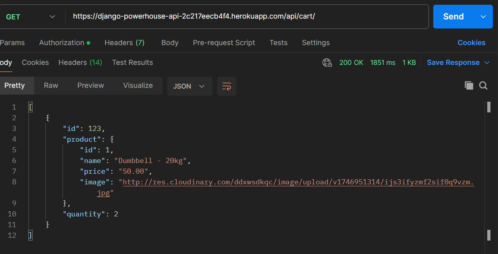

# Introduction

Powerhouse is a cutting-edge B2C eCommerce platform dedicated to gym enthusiasts, athletes, and anyone passionate about fitness. Specializing in high-quality gymwear and top-tier fitness equipment, Powerhouse offers a seamless online shopping experience tailored to individuals who demand both performance and style. From breathable, functional activewear to heavy-duty home gym gear, every product is curated to support serious training and everyday workouts alike. With user-friendly navigation and fast delivery, Powerhouse is the go-to online destination for fitness lovers looking to gear up and level up—all in one powerful platform.

### Project Goals

- To create REST APIs that assist in developing a visually appealing website
- To create REST APIs that are simple to implement with clear guidelines
- To create APIs that support the front-end.
- To create REST APIs that support all the required operations.

## Database Schemas

### User model

- The user model is the default Django user model.

| key          | Field Type    | Validation                  |
| ------------ | ------------- | --------------------------- |
| id           | IntegerField  |                             |
| password     | CharField     | max_length=128              |
| last_login   | DateTimeField |                             |
| is_superuser | BooleanField  |                             |
| username     | CharField     | max_length=150, unique=True |
| first_name   | CharField     | max_length=150, blank=True  |
| last_name    | CharField     | max_length=150, blank=True  |
| email        | EmailField    | max_length=254, unique=True |
| is_staff     | BooleanField  |                             |
| is_active    | BooleanField  |                             |
| date_joined  | DateTimeField |                             |

### Product model

- The product model is used to store all the available products.

| key         | Field Type      | Validation                                        |
| ----------- | --------------- | ------------------------------------------------- |
| id          | BigIntegerField | primary_key=True                                  |
| name        | CharField       | max_length=200                                    |
| description | TextField       |                                                   |
| price       | IntegerField    |                                                   |
| category    | ForeignKey      | Category, on_delete=models.SET_NULL               |
| image       | CloudinaryField |                                                   |
| created_at  | DateTimeField   | auto_now_add=True                                 |
| updated_at  | DateTimeField   | auto_now=True                                     |

### Category model

- The category model is used to store categories of products.

| key        | Field Type      | Validation        |
| ---------- | --------------- | ----------------- |
| id         | BigIntegerField | primary_key=True  |
| name       | CharField       | max_length=200    |
| created_at | DateTimeField   | auto_now_add=True |
| updated_at | DateTimeField   | auto_now=True     |

### Cart Item model

- The Cart item model is used to store cart items.

| key        | Field Type      | Validation                        |
| ---------- | --------------- | -----------------                 |
| id         | BigIntegerField | primary_key=True                  |
| quantity   | IntegerField    |                                   |
| user       | ForeignKey      | User, on_delete=models.CASCADE    |
| product    | ForeignKey      | Product, on_delete=models.CASCADE |
| added_at   | DateTimeField   | auto_now_add=True                 |

### ContactFormResponse model

- The ContactFormResponse model stores all contact forms sent to support/developers from users.

| key         | Field Type      | Validation       |
| ----------- | --------------- | ---------------- |
| id          | BigIntegerField | primary_key=True |
| name        | CharField       | max_length=100   |
| email       | CharField       | max_length=100   |
| subject     | CharField       | max_length=100   |
| description | TextField       |                  |

### Order model

- The Order model stores all orders placed by users.

| key           | Field Type      | Validation                      |
| -----------   | --------------- | ----------------                |
| id            | BigIntegerField | primary_key=True                |
| total_price   | IntegerField    |                                 |
| user          | ForeignKey      | User, on_delete=models.CASCADE  |
| first_name    | CharField       | max_length=100                  |
| last_name     | CharField       | max_length=100                  |
| email         | CharField       | max_length=255                  |
| state         | CharField       | max_length=100                  |
| address       | CharField       | max_length=255                  |
| zip           | CharField       | max_length=20                   |
| country       | CharField       | max_length=100                  |
| payment_method| CharField       | max_length=20                   |
| created_at    | DateTimeField   | auto_now_add=True               |

### Order Item model

- The Order Item model stores all items/products of an Order.

| key               | Field Type      | Validation                        |
| ------------------| --------------- | --------------------------------  |
| id                | BigIntegerField | primary_key=True                  |
| quantity          | IntegerField    |                                   |
| price_at_purchase | IntegerField    |                                   |
| product           | ForeignKey      | Product, on_delete=models.CASCADE |
| order             | ForeignKey      | Order, on_delete=models.CASCADE   |

## Agile development

Link to my [GitHub Agile Project](https://github.com/users/raed-nimer/projects/3)

I felt a bit more confident implementing the Agile methodology since I had experience from the last project. For this project, I decided to use Kanban and the MOSCOW prioritization method.

Epics and User stories helped me organize the project better. And it can be even more efficient when used within a team. I will continue using this methodology for my future projects, considering it very helpful. I will also start exploring Jira, which is also considered a good agile and project management tool.

I created four columns: Backlog, In Progress, In review, and Done. I also created 9 labels:

For MoSCoW prioritization: Must-have, Should-have, Could-have, Won't-have

5 helper labels: bug, Epic, documentation, enhancement, User-story

I created 7 Epics, divided into 12 user stories. Epics and User Stories are connected with the # link on the title and in the description.

| Example    | Image                                                |
| ---------- | ---------------------------------------------------- |
| Epic       |      |
| User story |  |

My Kanban board:

| At the start                                                | Current status                                                    |
| ----------------------------------------------------------- | ----------------------------------------------------------------- |
|  |  |

## Tools and technologies used

### Languages and Frameworks

This project was created using the following languages and frameworks:

- [Django](https://www.djangoproject.com/) as the Python web framework.
- [Python](https://www.python.org/) as the backend programming language.

### Django Packages
| Packages                                                                   | Description (copied from the web) |
| :------------------------------------------------------------------------- | ------------------------------------------------------------------------------------------------------------------------------------------------------------------------------------------------------------------------------------------------------------------------------ |
| [Django](https://pypi.org/project/Django/)                                 | Django is a high-level Python Web framework that encourages rapid development and clean, pragmatic design.|
| [Pillow](https://pypi.org/project/Pillow/)                                 | PIL is the Python Imaging Library.|
| [gunicorn](https://pypi.org/project/gunicorn/)                             | Gunicorn, 'Green Unicorn', is a Python WSGI HTTP Server for UNIX. It’s a pre-fork worker model ported from Ruby’s Unicorn project. The Gunicorn server is broadly compatible with various web frameworks, implemented, light on server resource usage, and fairly speedy. |
| [psycopg2](https://pypi.org/project/psycopg2/)                             | Psycopg is the most popular PostgreSQL database adapter for the Python programming language.|
| [dj3-cloudinary-storage](https://pypi.org/project/dj3-cloudinary-storage/) | Django package that provides Cloudinary storage for both media and static files and management commands for removing unnecessary files.|
| [dj-database-url](https://pypi.org/project/dj-database-url/)               | Use Database URLs in your Django Application.|
| [cloudinary](https://pypi.org/project/cloudinary/)                         | The Cloudinary Python SDK allows you to quickly and easily integrate your application with Cloudinary. Effortlessly optimize, transform, upload, and manage your cloud's assets.|
| [urllib3](https://pypi.org/project/urllib3/) | HTTP library with thread-safe connection pooling, file post, and more. |  
| [django-cors-headers](https://pypi.org/project/django-cors-headers/) | django-cors-headers is a Django application for handling the server headers required for Cross-Origin Resource Sharing (CORS). |
| [djangorestframework](https://pypi.org/project/djangorestframework/) | Web APIs for Django, made easy. |
| [djangorestframework_simplejwt](https://pypi.org/project/djangorestframework-simplejwt/) | A minimal JSON Web Token authentication plugin for Django REST Framework |

### Other tools and programs

- [Visual Studio Code.](https://code.visualstudio.com/) Did all of my coding and synchronizing with GitHub on VS Code.
- [Git](https://git-scm.com/) for version control.
- [GitHub](https://github.com/) for hosting repositories.
- [Heroku](https://www.heroku.com/) where the backend Django app is deployed.
- [Grammarly](https://www.grammarly.com/) was used to double-check spelling mistakes.
- [Lucid](https://lucid.co/) was used to create database ERD

# Features

### Register API

- Creates a new user account.

- Accepts firstName, lastName, email, and password.

- Validates that email and password are present.

- Checks for existing users by email.

- Returns User details, JWT access and refresh tokens, and a Success message

### Login API

- Authenticates an existing user using email and password.

- Validates presence of credentials.

- Checks if the user exists and the password matches.

- Returns User details, JWT access and refresh tokens, and a Success message

### Get Profile API

- Requires JWT access token (authentication).

- Fetches and returns the authenticated user's profile info.

- Returns user ID, first name, last name, email

### Update Profile API

- Requires JWT access token (authentication).

- Allows the user to update their profile.

- Returns updated user details and a success message.

### Get Products API

- Returns a list of all products.

- Each product includes: ID, Name, Description, Category name, Cloudinary image URL, Price

### Category List API

- Returns a list of all categories.

- Each product includes: ID, Name

### Product Detail API

- Returns details of a specific product by ID.

- Each product includes: ID, Name, Description, Category name, Cloudinary image URL, Price

### Get Cart API

- Retrieves all cart items for the authenticated user.

- Each item includes the cart item ID, product ID, name, price, image, and quantity

### Add to Cart API

- Adds a product to the cart

- If the product already exists, it increments the quantity.

### Update Cart API

- Updates the quantity of an existing cart item.

### Delete Cart API

- Deletes a specific item from the user's cart.

### Place Order API

- Places an order for the authenticated user based on the items in their cart.

- Captures user shipping details (name, email, address, country, state, zip) and payment method.

- Creates an order and associated order items from the cart.

### List Orders API

- Retrieves all orders for the authenticated user.

- Each order includes order ID, creation timestamp, total price, and a list of order items.

### Contact API

- Allows users to submit contact form details (name, email, subject, description)

- Saves submissions to the database.

# Testing

## Manual Testing (API)

All the APIs were testing using Postman.

| Expectation                                                                                 | Solution                                                                                                                                              | Image                                                                                                                |
|---------------------------------------------------------------------------------------------|-------------------------------------------------------------------------------------------------------------------------------------------------------|----------------------------------------------------------------------------------------------------------------------|
| As a user, I want to register a new account using my credentials.                           | Hitting the `Register API (/api/accounts/register)` with valid `firstName`, `lastName`, `email`, and `password` creates a new user and returns tokens and user details.        |                                                            |
| As a user, I want to log in with my email and password.                                     | Hitting the `Login API (/api/accounts/login)` with valid credentials authenticates the user and returns tokens and user details.                                            |                                                                  |
| As an authenticated user, I want to view my profile information.                            | Sending a GET request to the `Get Profile API (/api/accounts/profile)` with a valid JWT returns the user's ID, first name, last name, and email.                             |                                                          |
| As an authenticated user, I want to update my profile.                                      | Sending a POST request to the `Update Profile API (/api/accounts/profile)` with a valid JWT and new profile data updates the profile and returns updated data.          |                                                    |
| As a user, I want to view a list of all products.                                            | Sending a GET request to the `Get Products API (/api/products)` returns all products with name, description, category, image, and price.                              |                                                        |
| As a user, I want to view a list of available product categories.                           | Sending a GET request to the `Category List API (/api/products/categories)` returns all categories with their IDs and names.                                                     |                                                      |
| As a user, I want to view the details of a specific product.                                | Sending a GET request to the `Product Detail API (/api/products/{id})` with a product ID returns the complete details of that product.                                     |                                                    |
| As an authenticated user, I want to view items in my cart.                                  | Sending a GET request to the `Get Cart API (/api/cart)` with a valid JWT returns all cart items for the user.                                                     |                                                                |
| As an authenticated user, I want to add a product to my cart.                               | Sending a POST request to the `Add to Cart API (/api/cart/add)` adds the product or increments the quantity if already present.                                       |                                                            |
| As an authenticated user, I want to update the quantity of a cart item.                     | Sending a PUT request to the `Update Cart API (/api/cart/update/{id})` modifies the quantity of an existing cart item.                                                  |                                                          |
| As an authenticated user, I want to delete a cart item.                                     | Sending a DELETE request to the `Delete Cart API (/api/cart/delete/{id})` removes a specific item from the cart.                                                              |                                                          |
| As an authenticated user, I want to place an order using items in my cart.                  | Sending a POST request to the `Place Order API (/api/order/place)` with shipping and payment details creates an order and clears the cart.                              |                                                          |
| As an authenticated user, I want to view a list of my previous orders.                      | Sending a GET request to the `List Orders API (/api/order/list)` returns a list of all orders placed by the user with their details.                                   |                                                          |
| As a user, I want to contact the support team using a form.                                   | Sending a POST request to the `Contact API (/api/contact)` with contact form fields saves the data into the database.                                                |                                                              |

### PEP8 Code Institute Python Linter Validation

- All Python files were tested and passed through the [Code Institute PEP8](https://pep8ci.herokuapp.com/) linter validator.

#### Powerhouse app

| File        | Result                                                          |
| ----------- | --------------------------------------------------------------- |
| urls.py     |                    |
| settings.py | All clear, no errors found                                      |

#### accounts app

| File      | Result                     |
| --------- | -------------------------- |
| admin.py  | All clear, no errors found |
| apps.py   | All clear, no errors found |
| models.py | All clear, no errors found |
| tests.py  | All clear, no errors found |
| urls.py   | All clear, no errors found |
| views.py  | All clear, no errors found |

#### base app

| File      | Result                     |
| --------- | -------------------------- |
| admin.py  | All clear, no errors found |
| apps.py   | All clear, no errors found |
| models.py | All clear, no errors found |
| tests.py  | All clear, no errors found |
| urls.py   | All clear, no errors found |
| views.py  | All clear, no errors found |

#### cart app

| File      | Result                     |
| --------- | -------------------------- |
| admin.py  | All clear, no errors found |
| apps.py   | All clear, no errors found |
| models.py | All clear, no errors found |
| tests.py  | All clear, no errors found |
| urls.py   | All clear, no errors found |
| views.py  | All clear, no errors found |

#### orders app

| File      | Result                     |
| --------- | -------------------------- |
| admin.py  | All clear, no errors found |
| apps.py   | All clear, no errors found |
| models.py | All clear, no errors found |
| tests.py  | All clear, no errors found |
| urls.py   | All clear, no errors found |
| views.py  | All clear, no errors found |

#### product app

| File      | Result                     |
| --------- | -------------------------- |
| admin.py  | All clear, no errors found |
| apps.py   | All clear, no errors found |
| models.py | All clear, no errors found |
| tests.py  | All clear, no errors found |
| urls.py   | All clear, no errors found |
| views.py  | All clear, no errors found |

# Deployment

### Deploy with Heroku

1. Login to [Heroku](https://www.heroku.com/) if you already have an account or [sign up](https://signup.heroku.com/) if you don't.
2. Click on the "New" button on the top right of the home page and select "Create new App" from the drop-down menu.
3. In the "App name" field, enter the unique name of your app.
   - Heroku displays a green tick if your app name is available.
4. In the "Choose a region" field, choose either the United States or Europe based on your location.
5. Click the "Create app" button.
6. Next page, top centre of the screen, select the "Settings" tab.
7. In the "Config Vars" section, click on the "Reveal config Vars" button.
8. Add environment variables from the local env.py file to the "Config Vars" section:
   - SECRET_KEY - Django secret key.
   - DATABASE_USER - Database user.
   - DATABASE_HOST - Database host.
   - DATABASE_NAME - Database name.
   - DATABASE_PASS - Database password.
   - CLOUDINARY_URL - Cloudinary API URL
9. Copy and paste these variables into the KEY field and their values into the VALUE field.
10. Select the "Deploy" tab at the top of the screen.
11. In the "Deployment method" section, select "GitHub".
    1. In "Connect to GitHub," click on the "Search" button. Find the project repository in the list and click on the "Connect" button.
    2. Scroll to the bottom of that page. Click on the "Deploy Branch" button to deploy.
    3. You should also see an option to enable automatic deployment. If you enable this, every time you push to GitHub, Heroku will automatically deploy the app.
12. Once the build starts, you should be able to see the logs at the bottom of the page. After successfully finishing building the app, you should see the link to your app.

## Credits

- The web app is inspired by [Zalando](https://www.zalando.se/)
- [Code Institute](https://codeinstitute.net/) content and articles were really helpful in making this project a success.
- John Elder tutorials ([codemy.com](https://www.youtube.com/@Codemycom)) on django have helped in developing complex logic.
- [Slack community](https://slack.com/intl/en-ie/) for their support.

### Image resources
Images in this project are from the following resources:
- https://gymconcepts.ca/pages/fitness-equipment-for-corporate-office
- https://www.zalando.se/man-home/
- https://unsplash.com/s/photos/gym
